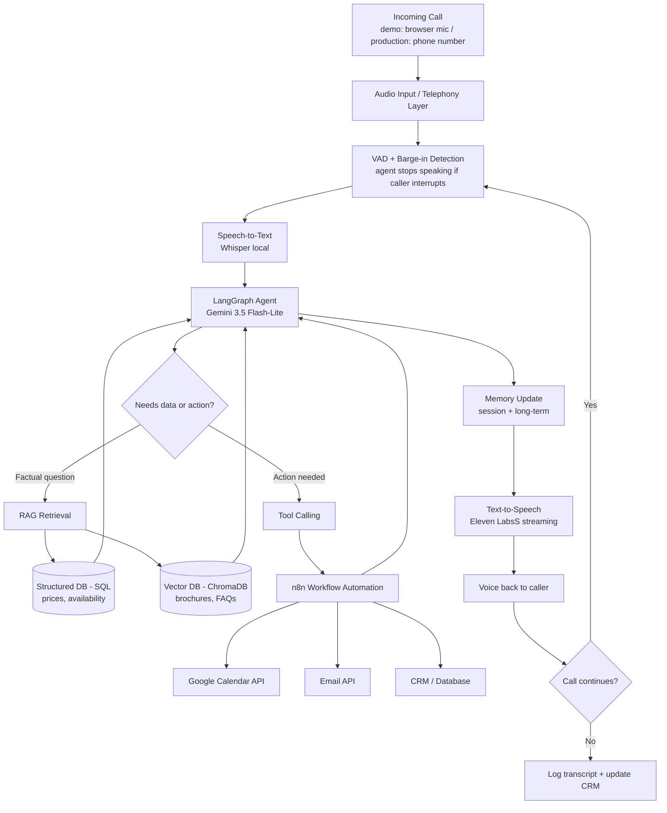
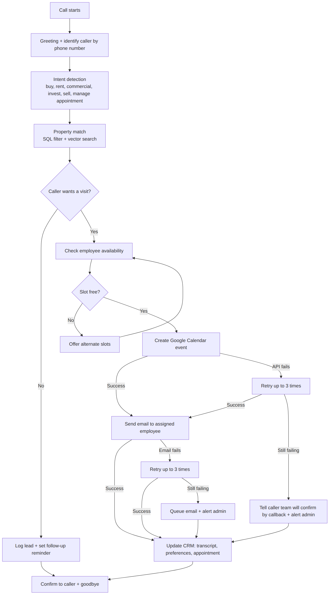

# Task 1 — Voice Agent Architecture Research

## Overview

A production-grade AI voice agent for real estate is not a single model. It is a pipeline of
specialised components working together in real time. Each incoming call passes through the
stages below in a continuous loop until the call ends.

## Pipeline Stages

### 1. Telephony / Audio Input Layer
Handles the call itself: receives the caller's voice as an audio stream and plays the agent's
voice back. In production this is a phone number connected through a telephony provider (SIP
trunk or provider API). Most telephony providers are paid, so **for the capstone demo the audio
comes from a browser microphone / Streamlit voice interface**. A real phone number is listed as
a production step, not a demo requirement (see `06_free_tier_tech_stack.md`).

### 2. Voice Activity Detection (VAD) and Barge-in
VAD detects when the caller starts and stops speaking. This gives two behaviours a phone agent
needs:
- **End-of-turn detection**: knowing when the caller has finished so the agent can reply quickly.
- **Barge-in**: if the caller interrupts while the agent is speaking, the agent stops talking
  immediately and listens (the "interrupt naturally" requirement).

### 3. Speech-to-Text (STT)
Converts the caller's live audio into text as they speak (streaming, not waiting for the full
sentence). It must cope with Urdu-English code-switching, Pakistani accents and phone-line noise.
**Chosen: Whisper, run locally.** Zero API cost and no rate limits. Known risks: Whisper's Urdu
accuracy is lower than its English accuracy, and on a CPU-only machine it can be slower than the
latency budget below. Both are measured in Day 3 rather than assumed.

### 4. LLM Reasoning
The transcript is sent to the LLM together with conversation history and the system prompt. The
LLM decides the caller's intent, whether to retrieve facts or call a tool, and what to say next.
**Chosen: Gemini 3.5 Flash-Lite** (Google AI Studio free tier). Rate limits must be checked on the
team's own dashboard (see `06_free_tier_tech_stack.md`).

### 5. Retrieval (RAG)
For factual questions ("is there a park nearby?", "what is the price of a 5 marla plot in DHA
Phase 6?"), the agent retrieves grounded information instead of guessing. Retrieval is split in
two, and this is what prevents hallucination:
- **Structured database (SQL)**: prices, availability, plot sizes, agent names (exact facts).
- **Vector database (ChromaDB)**: brochures, descriptions, FAQs (free-text knowledge).

### 6. Tool Calling
When the agent needs to act, not just talk (search properties, check availability, book, reschedule,
cancel, send email, update CRM), the LLM calls the relevant tool, waits for the result and uses it
in the next reply. Actions that touch Calendar, Email and CRM are executed through **n8n
workflows**, which handle retries and failures (see the Workflow Architecture below).

### 7. Memory
- **Short-term (session) memory**: everything said in this call (budget, area, properties discussed, name).
- **Long-term memory**: details of a returning customer from previous calls (past preferences and
  appointments), loaded from the CRM/database at call start after the caller confirms their name.

### 8. Text-to-Speech (TTS)
Converts the reply into natural speech (ElevenLabs) and streams it, so the caller hears the first
words before the whole sentence is generated. ElevenLabs was selected after the Task 4 listening
test; see `04_fish_audio_vs_elevenlabs.md`.

### 9. Workflow Orchestration
LangGraph coordinates the conversation as a stateful graph (greeting, intent detection, retrieval,
recommendation, booking, goodbye). n8n coordinates the business automation after a decision is made
(calendar event, employee email, CRM update).

## System Architecture Diagram




## Workflow Architecture (Call to CRM)

This is the end-to-end business workflow that n8n and LangGraph implement together
(Call, Intent, Property Match, Appointment, Calendar, Email, CRM), including failure handling.



```mermaid
flowchart TD
    A["Call starts"] --> B["Greeting + identify caller by phone number"]
    B --> C["Intent detection<br/>buy, rent, commercial, invest, sell, manage appointment"]
    C --> D["Property match<br/>SQL filter + vector search"]
    D --> E{"Caller wants a visit?"}
    E -->|"No"| L["Log lead + set follow-up reminder"]
    E -->|"Yes"| F["Check employee availability"]
    F --> G{"Slot free?"}
    G -->|"No"| H["Offer alternate slots"]
    H --> F
    G -->|"Yes"| I["Create Google Calendar event"]
    I -->|"Success"| J["Send email to assigned employee"]
    I -->|"API fails"| R["Retry up to 3 times"]
    R -->|"Success"| J
    R -->|"Still failing"| S["Tell caller team will confirm by callback + alert admin"]
    J -->|"Success"| K["Update CRM: transcript, preferences, appointment"]
    J -->|"Email fails"| R2["Retry up to 3 times"]
    R2 -->|"Success"| K
    R2 -->|"Still failing"| S2["Queue email + alert admin"]
    S --> K
    S2 --> K
   K --> M["Confirm to caller + goodbye"]
L --> M

## Latency Budget

Target from Day 3: under 2 seconds from the end of the caller's sentence to the first audio of the reply.

| Stage | Estimate |
|---|---|
| STT (streaming) | 200-400 ms |
| LLM reasoning + tool calls | 600-1000 ms |
| TTS (time to first audio) | 400-600 ms (ElevenLabs streaming) |
| Telephony / audio overhead | 100-200 ms |
| **Total** | **1.2 - 2.1 s** |
**ElevenLabs note:** ElevenLabs has a higher baseline latency than Fish Audio (~500 ms vs <200 ms
reported). This pushes the upper end of the budget closer to 2.2 s. This will be measured in Day 3.
If it exceeds 2 s, the plan is: shorter replies, filler phrases, and falling back to Fish Audio for
non-critical calls.
**Note:** these are planning estimates only. The upper end slightly exceeds 2 seconds, and local
Whisper on CPU may be slower. Real measurements are taken in Day 3 and the budget is adjusted then
(for example shorter replies, filler phrases such as "Ji, ek second sir" while a tool runs, or a
smaller Whisper model).
