# Task 2 — Conversation Flow Design

Each flow below is a state machine. The same structure becomes the LangGraph nodes in Day 5.
Flows 1-7 are the required flows. Flows 8 and 9 are extra flows added so the agent also handles
sellers and the failure cases (unclear, off-topic, silent, angry, injection) tested in Day 6.

Every flow ends in one of two ways: a booked appointment, or a logged lead with a follow-up. Diagram images are in `diagrams/`.

## 1. Buyer Inquiry

Goal: understand the requirement, present 2-3 grounded options, handle objections, book a visit. The first question also routes rent, invest and sell callers to their own flows.

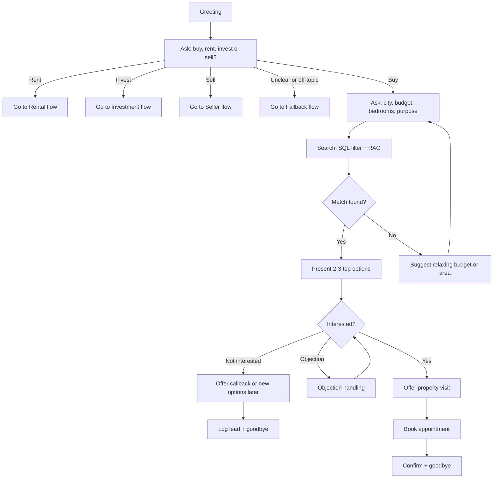

## 2. Rental Inquiry

Goal: match a rental to budget and preferences, explain deposit and tenancy terms from company records, book a viewing.

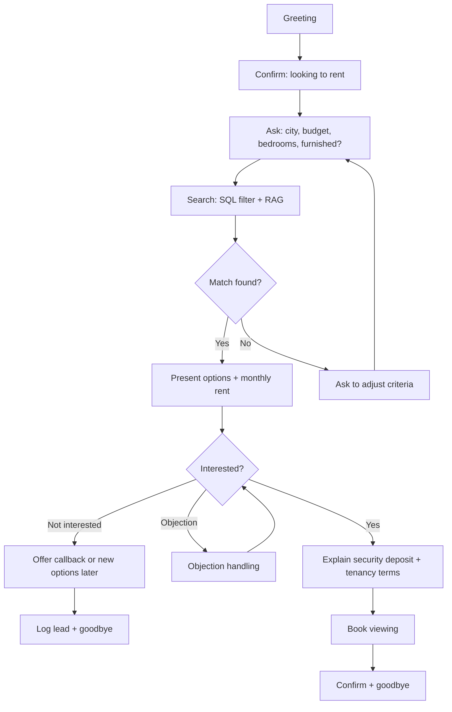

## 3. Commercial Property Inquiry

Goal: identify purpose (office, shop, warehouse), size and budget, present options and book a site visit.

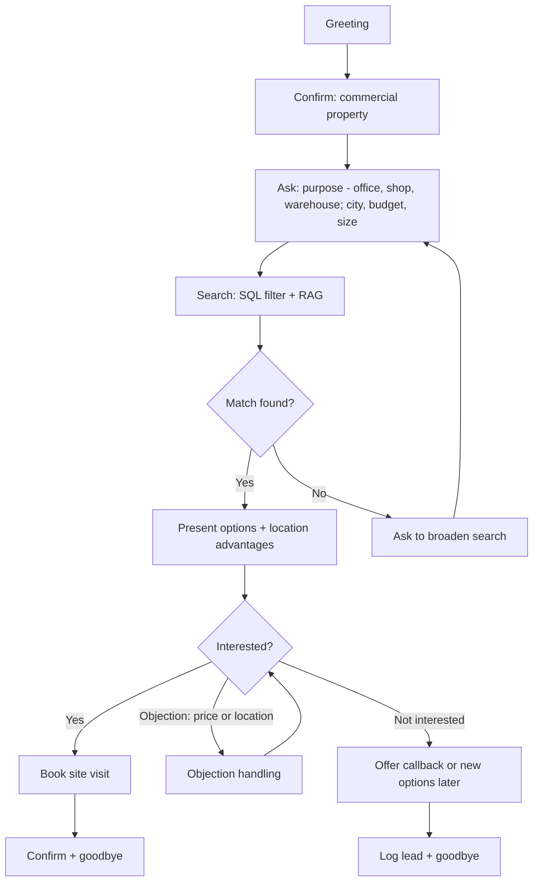

## 4. Investment Inquiry

Goal: understand the investment goal, present options using figures that exist in company records only (no invented returns), explain payment plan and developer, book a consultation.

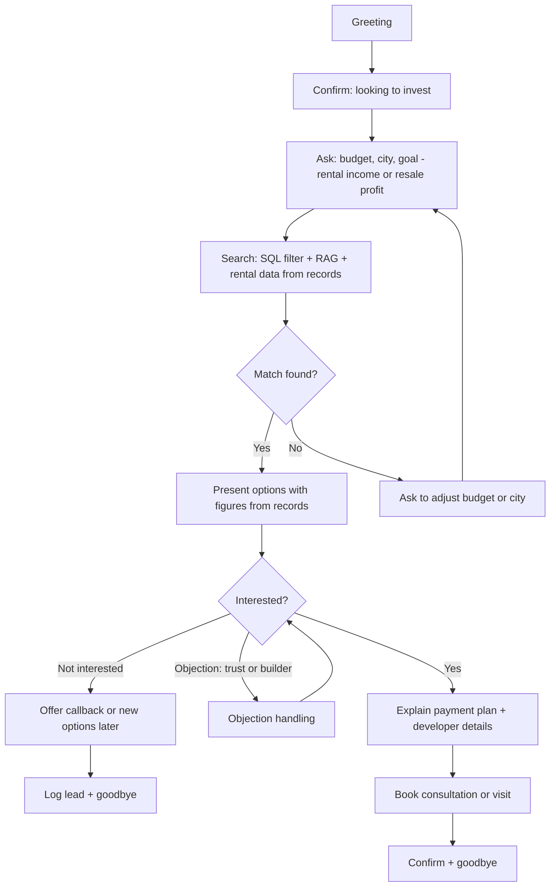

## 5. Returning Customer

Goal: recognise the caller by phone number, confirm their name before using any stored details (privacy), then continue from their earlier preferences.

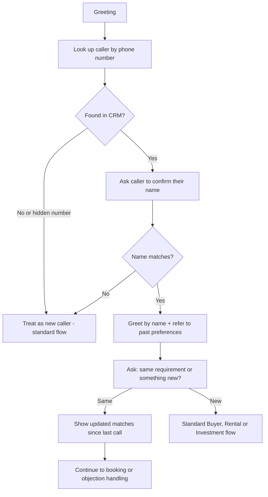

## 6. Appointment Rescheduling

Goal: find the existing appointment, check the calendar for the new slot, update Calendar and notify the employee by email.

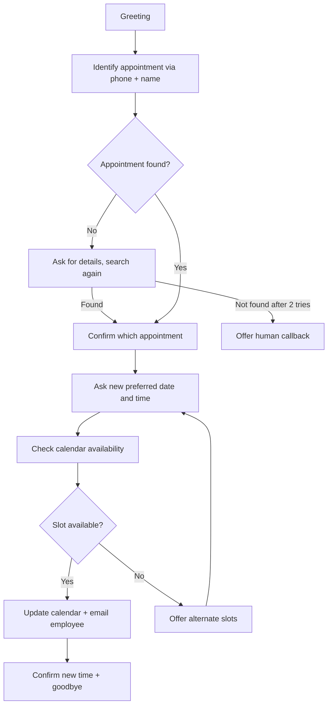

## 7. Appointment Cancellation

Goal: confirm the cancellation, cancel in Calendar, notify the employee, and softly offer a later rebooking.

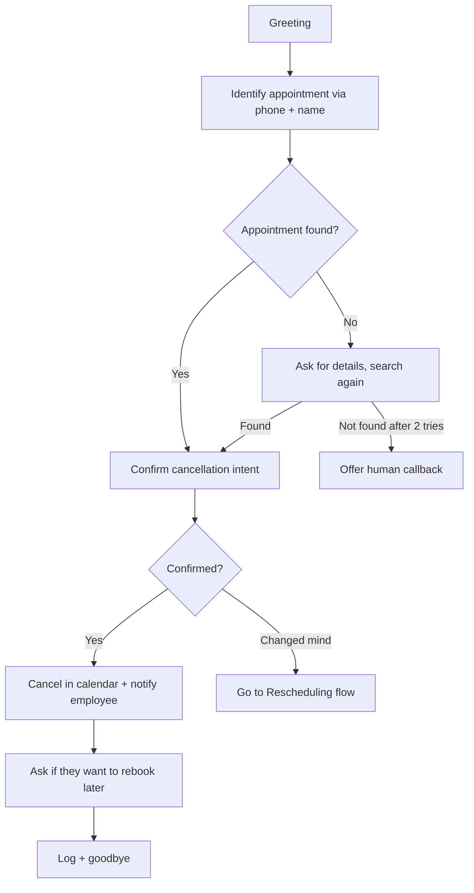

## 8. Seller Inquiry (extra flow)

Not in the Day 1 list, but the Day 6 test suite includes seller conversations. The agent does not value a property on the call; it captures details and hands over to a senior agent.

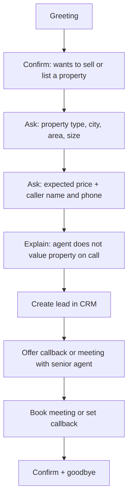

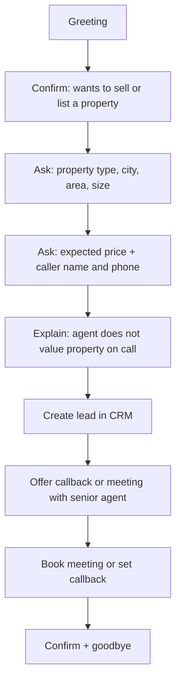

## 9. Fallback Handling (shared by all flows)

Covers unclear speech, off-topic talk, silence, angry callers, prompt-injection attempts and the question 'are you an AI?'. Every flow routes here when the caller goes off the expected path.

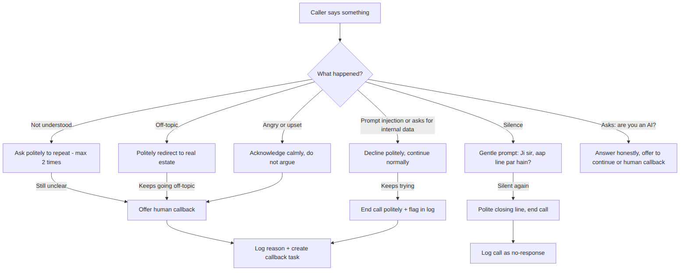

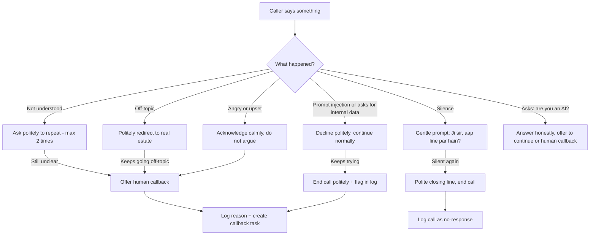
